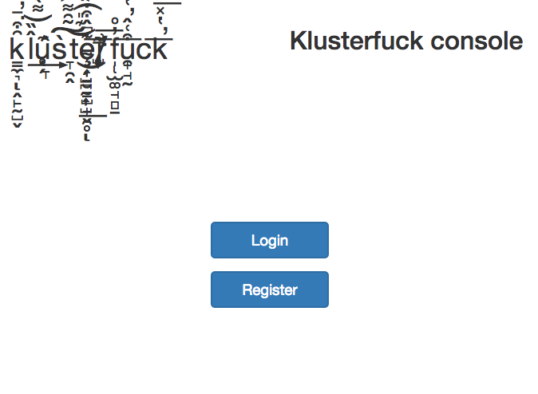
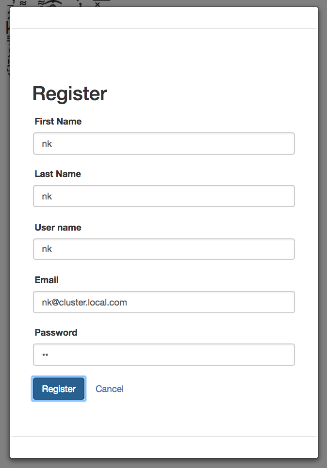
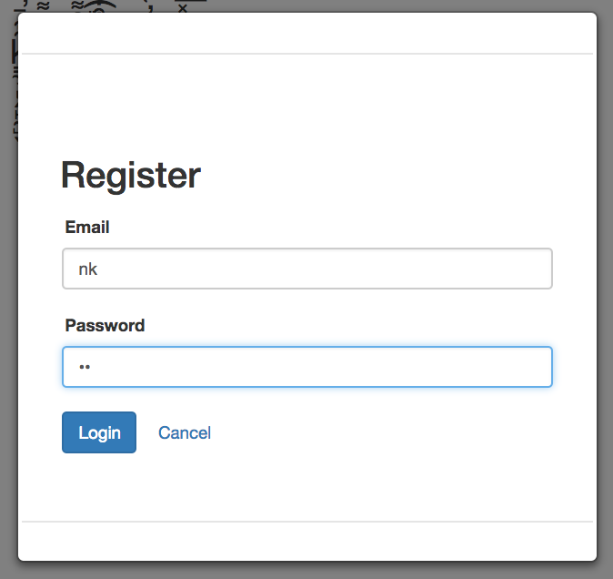
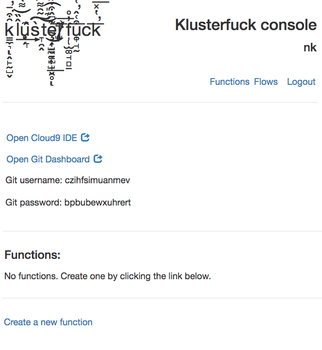
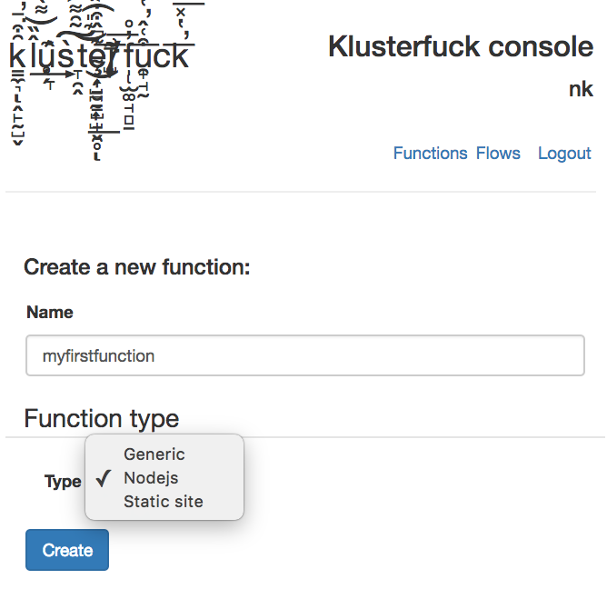
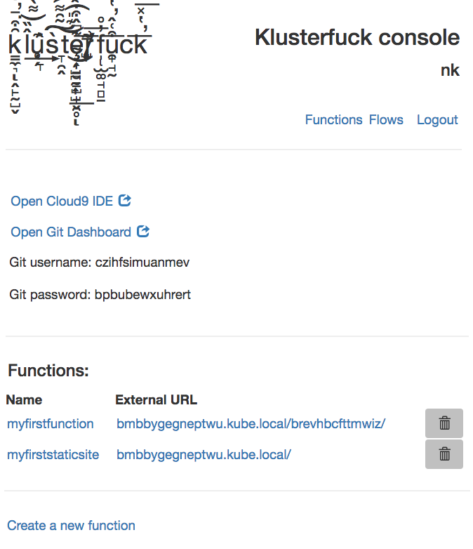
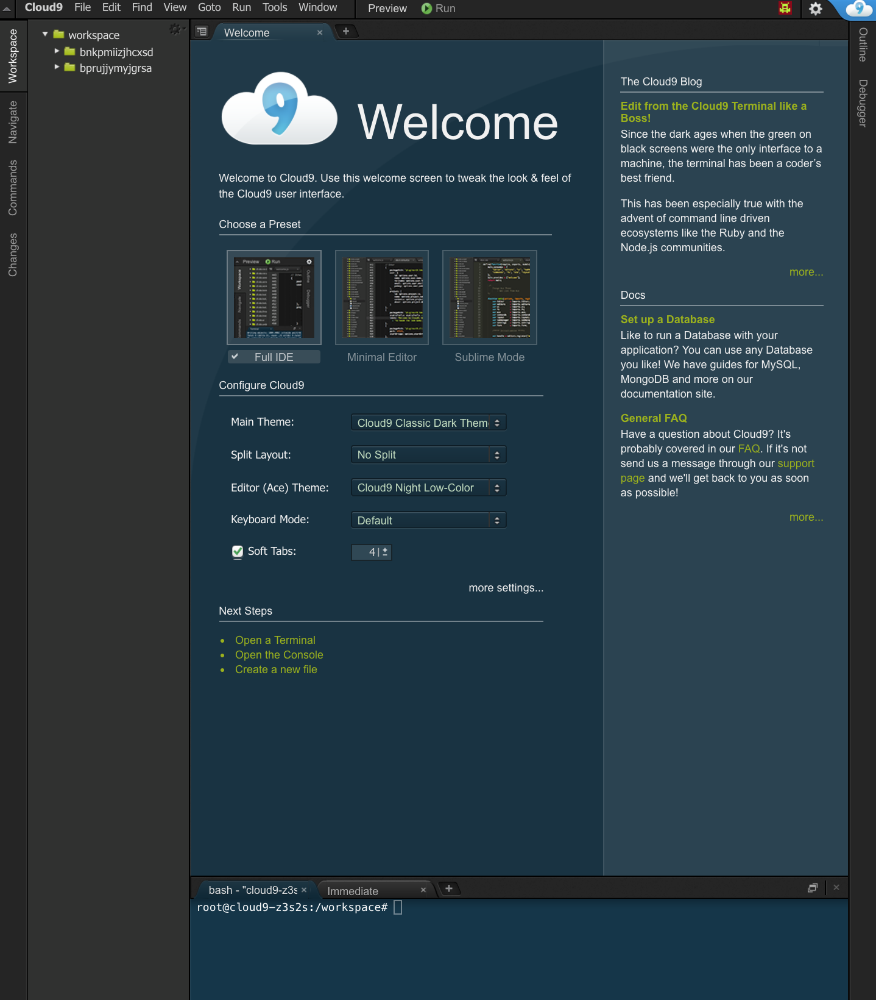
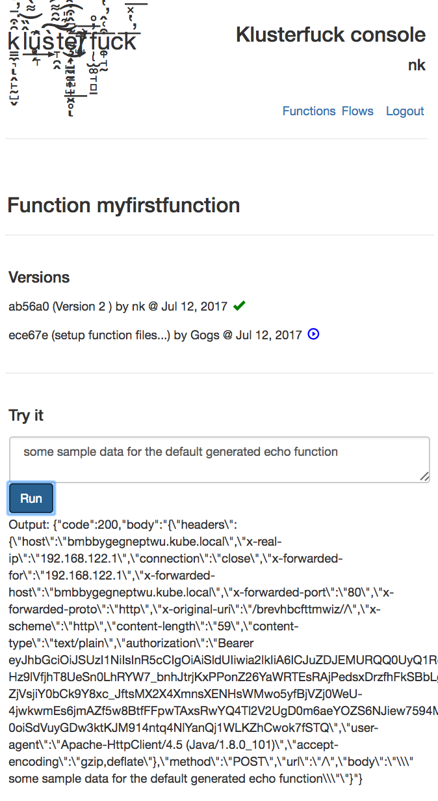

# Klusterfuck
Klusterfuck is a serverless framework for kubernetes. Serverless, or Functions-as-a-Service (FaaS)
is a model where a user writes stateless functions and the 
platform manages everything else, like deployments, ingress/egress, load-balancing, scaling...

### What are Klusterfuck functions?
Any shell script, python or nodejs program, or standalone binary can be a klusterfuck function. 
Creating a function will also generate sample working code which can be used as a template.
In future, I plan to support more runtimes.

Currently supported functionality:
1. Nodejs functions
2. Executable scripts (bash, nodejs, python) or static linked binaries
3. static sites

## How does it work?
When a user registers, a k8s namespace is created exclusively for the user, 
which contains a gogs git server, cloud9 IDE and a service for authenticating requests 
through openid-connect.
Users can then create functions using a builtin dashboard or REST API.

When creating a function, a git repository is created with a default configuration for the type of 
function created. The function repository is also cloned in the cloud9 IDE pod so that users can work 
with their functions without any other tools.
If desired, users can then clone the repo and push changes to it. Klusteruck REST API or the 
included dashboard can be used to update or rollback to a specific commit id in the git repo.

For every function, a kubernetes deployment, service, and ingress are created. A worker image 
is responsible for checking out the currently selected commit id from git and reading configuration 
and function code from it. 
Each function gets a unique URL which can be used to invoke it. 
The function URLs are protected and requests must contain a valid authentication token which can be 
retrieved from Klusterfuck REST API, like so:

`curl -XPOST klusterfuck.kube.local/api/v1/auth/login 
    -d'{"username": "your username", "password": "your password"}' -H"Content-Type: application/json"`

Then include the 'accessToken' field in your requests `curl <your function's URL> ... -H"Authorization: Bearer <accessToken, don't include the < and > chars>"`

Functions can be connected to non-HTTP events, and/or chained together using flows. 
A flow is a directed acyclic graph (DAG) of 'connector's and functions. 
Connectors connect functions to endpoints (only supports HTTP as of now), message queues, timers, etc. 
A flow DAG is asynchronously computed. A graphical editor is included in the dashboard.

Connectors are simple docker images which are configured using environment variables. The connector
API is always going to be very simple so that anyone can easily make a connector if one is not available
for their use case. The HTTP connector, for example, only requires one environment variable: the address 
where the request payloads will be forwarded.

### how to use:
Klusterfuck is not meant for serious use-cases yet, please only try it in a secure network using 
minikube or an isolated kubernetes deployment.

As of now, there is no security and admin and agent APIs are open to all. 

This project contains a kubernetes manifest file which will deploy Klusterfuck admin and Keycloak. Keycloak 
is an IAM server which is used to provide security for keycloak admin APIs and users' functions related APIs.

### Roadmap
 - Central logging per user
 - Integrate an API gateway
 - Throttling and metering
 - Pod horizontal scaling
 - Support if/else, loops, join etc. kinds of nodes in flow

##### Requirements
A k8s 1.5+ cluster with an ingress controller. I recommend using minikube for a local setup, and enabling
the ingress controller add-on.
##### DNS resolution for ingress hosts in local setup
I recommend using libnss resolver: this should be available out of the box with OSX, for linux, see: https://github.com/azukiapp/libnss-resolver

If you have libnss resolver setup, point *.kube.local to minikube's ip (get it by running `minikube ip`).

If you do not want to use libnss resolver, you could add entries for the hosts in your /ets/hosts file.

#### Installation
Klusterfuck has been tested with k8s version 1.5, 1.6 and 1.7.

To deploy, for kubernetes version < 1.6, run 
 
 `kubectl create -f https://raw.githubusercontent.com/n-k/klusterfuck/master/k8s/all_k8s_15.yaml`
Then run `kubectl create clusterrolebinding kf-cluster-binding --clusterrole=cluster-admin --serviceaccount=klusterfuck:default`

For kubernetes version >= 1.6, run 

`kubectl create -f https://raw.githubusercontent.com/n-k/klusterfuck/master/k8s/all.yaml`

This will create the deployment and services in 'klusterfuck' namespace.

Wait for the pods to start and reach 'running' state. Then port forward the klusterfuck-admin pod by 
running:

`kubectl -n klusterfuck port-forward $(kubectl -n klusterfuck get pod -l app=klusterfuck -o template --template="{{(index .items 0).metadata.name}}") 8080:8080`

##### Dashboard tour: functions
Now you should be able to go to [http://localhost:8080](http://localhost:8080) in your favorite 
browser and reach the klusterfuck console. If you have an ingress controller and DNS setup correctly,
console should also be available at [http://klusterfuck.kube.local](http://klusterfuck.kube.local)

The console should look like 

Click register and enter details if you are using this for the first time (see example values in screenshot below).
Note that the username determines the URLs for your functions. The URL scheme is similar to 
{username}.kube.local/{function's id}, {username}.kube.local/auth, etc.

After successfully registering, you should login:

and you should be presented with the functions console:

The functions console has links to open gogs and Cloud9 and shows the credentials for gogs 
(every user gets their own gogs server and randomly generated username and password).
You should now be able to create function by clicking the link at bottom:

The console will list all your functions, and their externally accessible URLs 
(shown below with one function and one static site). The first static site created gets 
a path of '/', rest are generated randomly:

Opening the Cloud9 IDE page will have all your functions' repositories cloned. You will 
be asked to login with your klusterfuck credentials to access this page.

Now go to a function's page by clicking the link in 'Name' column in functions console.
All git revisions will be listed and you can deploy any of the revisions by clicking the 
 icon. You can also invoke the function with text input.

##### Dashboard tour: flows
Coming soon.

#### Cleanup
Run `kubectl delete ns klusterfuck`. Individual functions and flows can be deleted via REST API or the dashboard - deleting
them will also clean up associated kubernetes resources.

Also run `kubectl delete ns -l owner=klusterfuck`, this deletes the user namespaces
which contains users' functions. Note that this will also delete the gogs pod and you will lose 
all repos in gogs.

### Dev docs
[Dev Guide](./docs/dev-guide.md)

## License
Everything in this repo is distributed under the WTF public license (WTFPL). A copy of the license 
can be found here [WTFPL](http://www.wtfpl.net).
